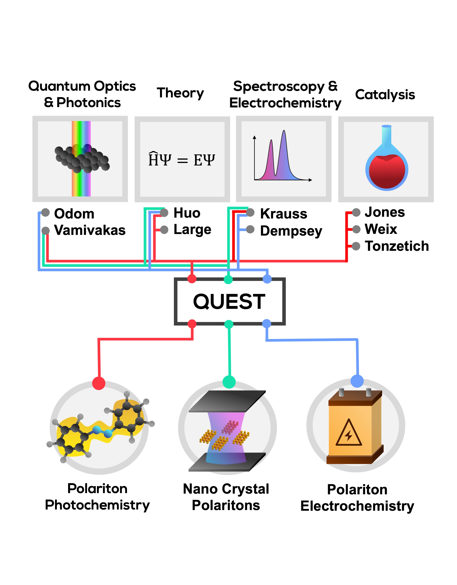

## Center for Quantum Electrodynamics for Selective Transformations ("NSF QuEST CCI")

### Administration
Name:  Todd Krauss\
Email: todd.krauss@rochester.edu

### Grant Information
All work herein was supported by the National Science Foundation “Center forQuantum Electrodynamics forSelective Transformations (QuEST)” under Grant CHE-2124398.

### Publications

1. Weight et al., . Phys. Chem. Lett., 2023, 14, 25, 5901–5913
    - Braden M. Weight -- bweight@ur.rochester.edu
    - Pengfei Huo -- pengfei.huo@rochester.edu

1. Koessler et al., J. Chem. Phys., 157, 064101 (2022)
    - Eric Koessler -- ekoessle@ur.rochester.edu
    - Pengfei Huo -- pengfei.huo@rochester.edu

1. Taylor et al., Opt. Lett., 47, 6, 1446-1449 (2022)
    - Michael A. D. Taylor -- mtayl29@u.rochester.edu
    - Pengfei Huo -- pengfei.huo@rochester.edu

